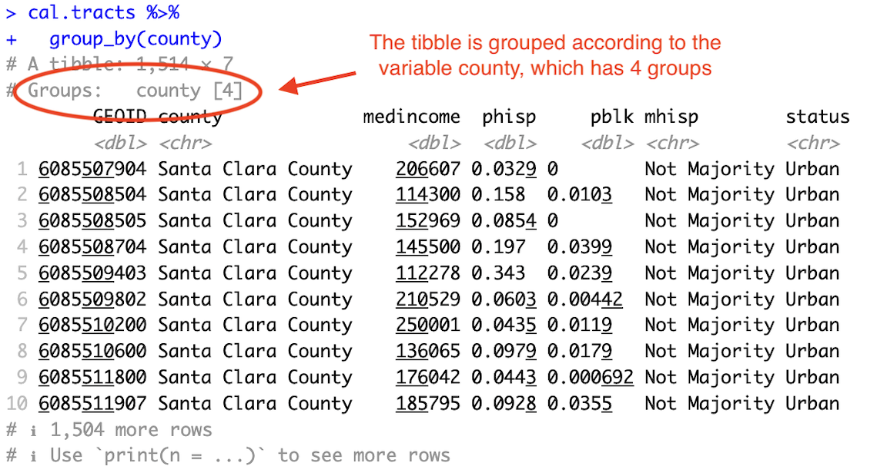
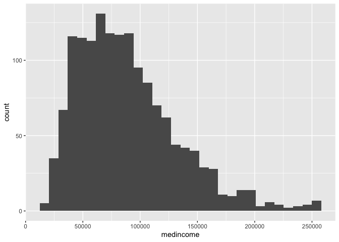
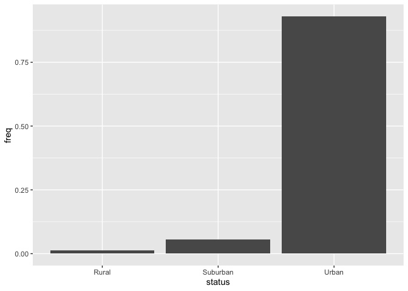
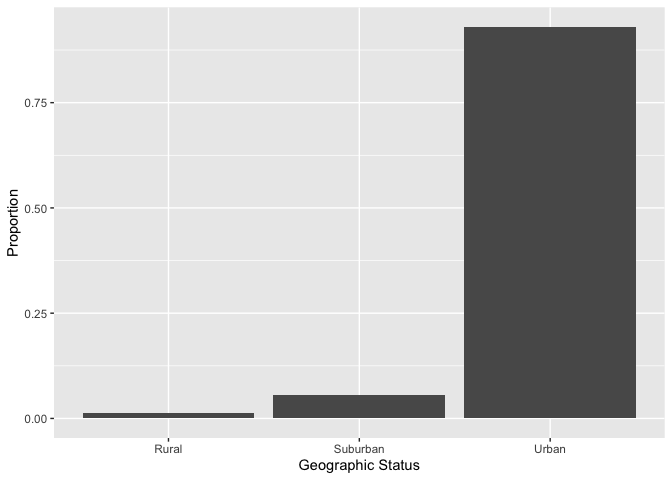
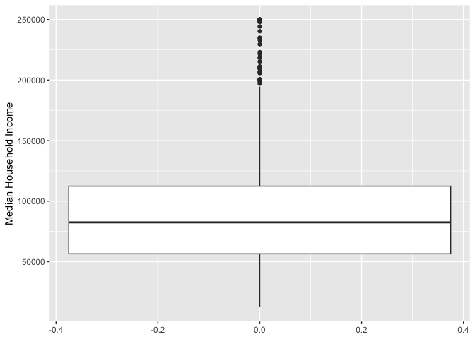
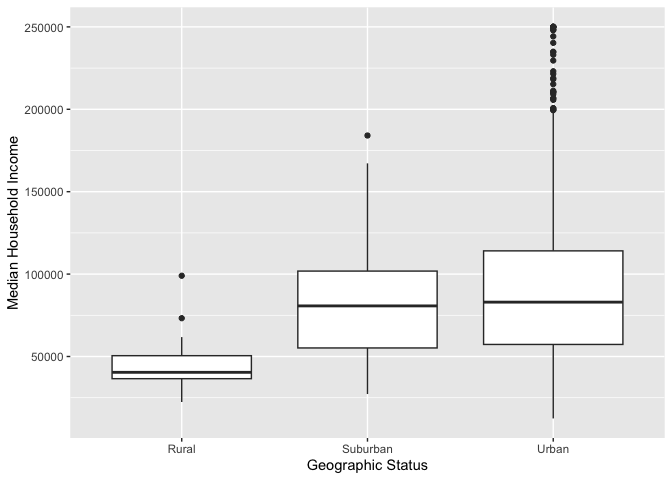
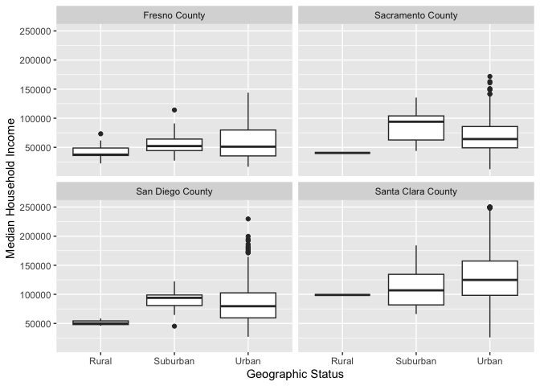
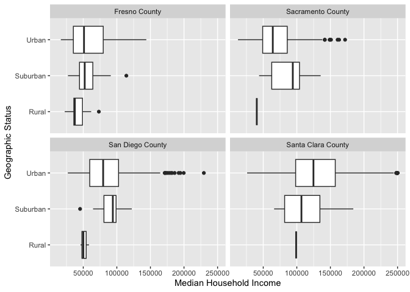
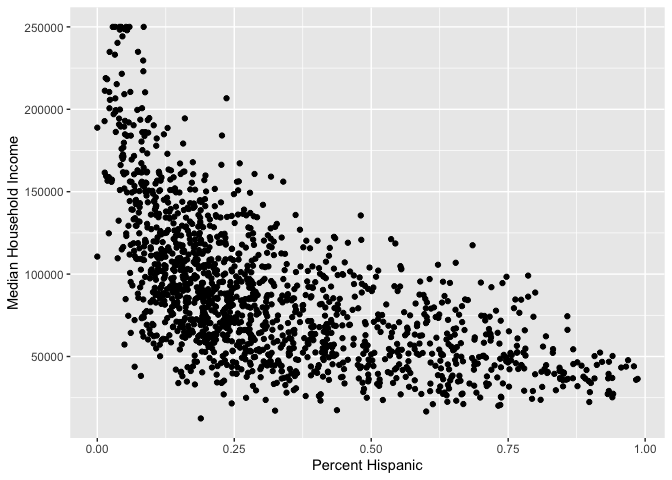

<style>
p.comment {
background-color: #DBDBDB;
padding: 10px;
border: 1px solid black;
margin-left: 25px;
border-radius: 5px;
font-style: normal;
}

.figure {
   margin-top: 20px;
   margin-bottom: 20px;
}

h1.title {
  font-weight: bold;
  font-family: Arial;  
}

h2.title {
  font-family: Arial;  
}

</style>


<style type="text/css">
#TOC {
  font-size: 13px;
  font-family: Arial;
}
</style>


\


The goal of this lab is to acquire skills in running descriptive statistics and creating graphs using R. Make sure you've read and fully understood Handout 4 as this guide tracks closely with the material presented there. In this lab, we will be working with census tract data from the U.S. [American Community Survey](https://www.census.gov/programs-surveys/acs) and the U.S. [Department of Agriculture](https://www.ers.usda.gov/).  As described in Handout 3, census tracts are the traditional measure of neighborhoods in the United States.  The objectives of the guide are as follows

1. Learn how to use various R functions to summarize neighborhood characteristics
2. Learn how to make presentation-ready tables of descriptive statistics
3. Introduction to R graphics

This lab guide follows closely and supplements the material presented in Chapters 1,3, 7 and 28 in the textbook [R for Data Science](http://r4ds.had.co.nz/index.html) (RDS) and the class Handout 4.

<p class="comment">**Assignment 4 is due by 12:00 pm, April 30th on Canvas.**  See [here](https://ezufall.github.io/crd150_2026.github.io/hw_guidelines.html) for assignment guidelines.  You must submit an `.Rmd` file and its associated `.html` file. Name the files: yourLastName_firstInitial_asgn04. For example: brazil_n_asgn04.</p>

<div style="margin-bottom:25px;">
</div>
## **Open up a R Markdown file**
\

Download the [Lab template](https://raw.githubusercontent.com/crd150/data/master/labtemplate.Rmd) into an appropriate folder on your hard drive (preferably, a folder named 'Lab 4'), open it in R Studio, and type and run your code there. The template is also located on Canvas under Files. Change the title ("Lab 4") and insert your name and date. Don't change anything else inside the YAML (the stuff at the top in between the `---`).  Also keep the grey chunk after the YAML. For a rundown on the use of R Markdown, see the [assignment guidelines](https://ezufall.github.io/crd150_2026.github.io/hw_guidelines.html)

<div style="margin-bottom:25px;">
</div>
## **Installing and loading packages**
\

We will be installing two new packages in this lab. Install the following packages. These packages will be needed to create presentation ready tables. Remember, you only do this once, and never within your R Markdown.


``` r
install.packages("flextable")
install.packages("webshot")
```


Load the following packages using `library()`. Remember, you need to do this every time you run an R session, so the following code should appear at the top of your R Markdown file.


``` r
library(tidyverse)
library(flextable)
library(webshot)
```


<div style="margin-bottom:25px;">
</div>
## **Reading in census tract data**
\

You will be working with census tract data for the counties of Sacramento, San Diego, Santa Clara, and Fresno, four of the largest counties in California.  To save us time, I downloaded Census data, wrangled the data, and uploaded it on GitHub. The data file and its metadata are also located on Canvas in the Week 4 Lab folder under Files. Let's bring the csv file into R using `read_csv()`.


``` r
cal.tracts <- read_csv("https://raw.githubusercontent.com/crd150/data/refs/heads/master/lab4_data.csv")
```

Make sure you take a look at any dataset you bring into R.


``` r
glimpse(cal.tracts)
```

```
## Rows: 1,514
## Columns: 7
## $ GEOID     <dbl> 6085507904, 6085508504, 6085508505, 6085508704, 6085509403, …
## $ county    <chr> "Santa Clara County", "Santa Clara County", "Santa Clara Cou…
## $ medincome <dbl> 206607, 114300, 152969, 145500, 112278, 210529, 250001, 1360…
## $ phisp     <dbl> 0.03286385, 0.15841469, 0.08540341, 0.19652036, 0.34261983, …
## $ pblk      <dbl> 0.0000000000, 0.0103440260, 0.0000000000, 0.0399367339, 0.02…
## $ mhisp     <chr> "Not Majority", "Not Majority", "Not Majority", "Not Majorit…
## $ status    <chr> "Urban", "Urban", "Urban", "Urban", "Urban", "Urban", "Urban…
```

The dataset contains tract-level median household income, percent Hispanic, percent Black, whether the tract is urban, suburban or rural according to [Rural-Urban Commuting Area Codes (RUCA)](https://www.ers.usda.gov/data-products/rural-urban-commuting-area-codes) and whether the tract is "Majority" Hispanic (*phisp* > 50%) or "Not Majority" Hispanic.  

<div style="margin-bottom:25px;">
</div>
## **Summarizing a single variable**
\

Recall from Handout 4 our two important data types: categorical and numeric. Let's first summarize a single numeric variable - neighborhood median household income - using some basic descriptive statistics.

<div style="margin-bottom:25px;">
</div>
### **Numeric variables**
\

We can use the function `summarize()` to calculate mean neighborhood income.  The first argument inside `summarize()` is the data object *cal.tracts* and the second argument is the function calculating the specific summary statistic, in this case `mean()`, which unsurprisingly calculates the mean of the variable you indicate in between the parentheses.


``` r
cal.tracts %>%
      summarize(mean(medincome))
```

```
## # A tibble: 1 × 1
##   `mean(medincome)`
##               <dbl>
## 1                NA
```

We get the value *NA*, which as we learned in [Lab 3](https://ezufall.github.io/crd150_2026.github.io/lab3.html#Missing_data) represents a missing value. If a variable has missing values, functions like `mean()` will return an `NA`.  If we use the function `summary()`, we find that *medincome* has 6 tracts with missing median income values


``` r
summary(cal.tracts)
```

```
##      GEOID              county            medincome          phisp       
##  Min.   :6.019e+09   Length:1514        Min.   : 12417   Min.   :0.0000  
##  1st Qu.:6.067e+09   Class :character   1st Qu.: 56479   1st Qu.:0.1512  
##  Median :6.073e+09   Mode  :character   Median : 82443   Median :0.2475  
##  Mean   :6.068e+09                      Mean   : 88873   Mean   :0.3181  
##  3rd Qu.:6.073e+09                      3rd Qu.:112372   3rd Qu.:0.4360  
##  Max.   :6.086e+09                      Max.   :250001   Max.   :0.9864  
##                                         NA's   :6                        
##       pblk            mhisp              status         
##  Min.   :0.00000   Length:1514        Length:1514       
##  1st Qu.:0.01092   Class :character   Class :character  
##  Median :0.02974   Mode  :character   Mode  :character  
##  Mean   :0.04994                                        
##  3rd Qu.:0.06997                                        
##  Max.   :0.40050                                        
## 
```

In order to calculate the mean (or any numeric descriptive statistic) for a variable with missing values, use the argument `na.rm = TRUE`, which will calculate the mean of the variable without the missing values.


``` r
summarize(cal.tracts, mean(medincome, na.rm = TRUE))
```

```
## # A tibble: 1 × 1
##   `mean(medincome, na.rm = TRUE)`
##                             <dbl>
## 1                          88873.
```


Does the average neighborhood income differ by county?  We need to pair `summarize()` with the function `group_by()` to answer this question.  The function `group_by()` tells R to run subsequent functions on the data object *by* a group characteristic (such as gender, educational attainment, or in this case, county). Let's use our new best friend `%>%`, who we met in [Lab 2](https://ezufall.github.io/crd150_2026.github.io/lab2.html#Pipes), to accomplish this task.


``` r
cal.tracts %>%
  group_by(county) %>%
  summarize(mean(medincome, na.rm = TRUE))
```

```
## # A tibble: 4 × 2
##   county             `mean(medincome, na.rm = TRUE)`
##   <chr>                                        <dbl>
## 1 Fresno County                               57128.
## 2 Sacramento County                           71183.
## 3 San Diego County                            83753.
## 4 Santa Clara County                         129391.
```

The first pipe sends *cal.tracts* into the function *group_by()*, which tells R to group *cal.tracts* by the variable *county*.  


``` r
cal.tracts %>%
  group_by(county)
```

How do you know the tibble is grouped? Because it tells you 

<br>

<center>


</center>

<br>

The second pipe takes this grouped dataset and sends it into the `summarize()` command, which calculates the mean neighborhood income (by county, because the dataset is grouped by county).

We can calculate more than one summary statistic within `summarize()`.  For example, to get the mean, median, standard deviation and interquartile range (IQR) of median income, and give column labels for the variables in the resulting summary table, we type in


``` r
cal.tracts %>%
  group_by(county) %>%
  summarize(Mean = mean(medincome,  na.rm = TRUE),
            Median = median(medincome, na.rm = TRUE),
            SD = sd(medincome,  na.rm = TRUE),
            IQR = IQR(medincome,  na.rm = TRUE))
```

```
## # A tibble: 4 × 5
##   county                Mean Median     SD    IQR
##   <chr>                <dbl>  <dbl>  <dbl>  <dbl>
## 1 Fresno County       57128.  50318 28347. 36875.
## 2 Sacramento County   71183.  65114 29249. 37807 
## 3 San Diego County    83753.  79953 33262. 42475 
## 4 Santa Clara County 129391. 123469 46599. 60069.
```

<br>

Remember from Handout 4 that the IQR is the difference between the 75th and 25th percentiles.  It is a measure of spread, and more generally, an indicator of inequality.  Another measure of spread or inequality is the 90/10 ratio. To calculate this ratio, we'll first need to calculate the 90th and 10th percentiles using the `quantile()` command, where we indicate the percentile using the argument `p = `. We can do all of this inside `summarize()`. Make sure you understand what each function in the code below is doing, and what the values reported are showing. 


``` r
cal.tracts %>%
  group_by(county) %>%
  summarize(p90 = quantile(medincome, p = 0.90,  na.rm = TRUE),
            p10 = quantile(medincome, p = 0.10,  na.rm = TRUE),
            Ratio9010 = p90/p10) %>%
  select(-(c(p90,p10)))
```

```
## # A tibble: 4 × 2
##   county             Ratio9010
##   <chr>                  <dbl>
## 1 Fresno County           3.57
## 2 Sacramento County       2.89
## 3 San Diego County        2.80
## 4 Santa Clara County      2.58
```


<div style="margin-bottom:25px;">
</div>
### **Categorical variables**
\

Let's next summarize a single categorical variable.  *status* indicates whether a tract is urban, suburban or rural. 

To get the proportion of tracts that are urban, suburban and rural, you'll need to combine the functions `group_by()`, `summarize()` and `mutate()` using `%>%`.


``` r
cal.tracts %>%
  group_by(status) %>%
  summarize(n = n()) %>%
  mutate(total = sum(n),
        freq = n / total)
```

```
## # A tibble: 3 × 4
##   status       n total   freq
##   <chr>    <int> <int>  <dbl>
## 1 Rural       20  1514 0.0132
## 2 Suburban    86  1514 0.0568
## 3 Urban     1408  1514 0.930
```

Let's break up this chunk of code to show exactly what was done here. First, *cal.tracts* was piped into the `group_by()` function.  Next, `group_by(status)` separates the neighborhoods by geographic status. We then used `summarize()` to count the number of neighborhoods by geographic status.  The function to get a count is `n()`, and we saved this count in a variable named *n*. This gave us the following table.


``` r
cal.tracts %>%
  group_by(status) %>%
  summarize (n = n())
```

```
## # A tibble: 3 × 2
##   status       n
##   <chr>    <int>
## 1 Rural       20
## 2 Suburban    86
## 3 Urban     1408
```

Remember, we are trying to get the proportion of neighborhoods that are urban, suburban and rural. This means we need a numerator - the number of neighborhoods that are urban, suburban and rural. This is what `n = n()` gives us. There are 1,408 neighborhoods that are designated as urban.

Next, this table is piped into  `mutate()`, which creates a variable *total* which gives you the denominator - the total number of neighborhoods. The code `sum(n)` adds the values of *n*:  1408+86+20 = 1514. We then create a variable *freq*, which divides the value of each *n* by this sum:  20/1514. = 0.0132, 86/1514 = 0.0568 and 1408/1514. = 0.930.  This yields the proportion of all neighborhoods by geographic status (how would you transform this to a percentage?). 


``` r
cal.tracts %>%
  group_by(status) %>%
  summarize (n = n()) %>%
    mutate(total = sum(n),
        freq = n / total)
```

```
## # A tibble: 3 × 4
##   status       n total   freq
##   <chr>    <int> <int>  <dbl>
## 1 Rural       20  1514 0.0132
## 2 Suburban    86  1514 0.0568
## 3 Urban     1408  1514 0.930
```

 
<div style="margin-bottom:25px;">
</div>
## **Summarizing two variables**
\

The functions we've gone through so far describe **one** variable. It is often the case that we are interested in understanding whether two variables are associated with one another. 

Let's go through the ways we can describe the association between: (1) two categorical variables; (2) one categorical variable and one numeric variable; and (3) two numeric variables.

<div style="margin-bottom:25px;">
</div>
### **Two categorical variables**
\

To summarize the relationship between two categorical variables, you'll need to find the proportion of observations for each combination, also known as a cross tabulation. Let's create a cross tabulation of the categorical variables *status* and *mhisp*. We do this by using both variables in the `group_by()` command.


``` r
cal.tracts %>%
  group_by(status, mhisp) %>%
  summarize(n = n())  %>%
    mutate(total = sum(n),
        freq = n / total)
```

```
## # A tibble: 6 × 5
## # Groups:   status [3]
##   status   mhisp            n total  freq
##   <chr>    <chr>        <int> <int> <dbl>
## 1 Rural    Majority        14    20 0.7  
## 2 Rural    Not Majority     6    20 0.3  
## 3 Suburban Majority        35    86 0.407
## 4 Suburban Not Majority    51    86 0.593
## 5 Urban    Majority       264  1408 0.188
## 6 Urban    Not Majority  1144  1408 0.812
```

A much higher proportion of rural neighborhoods are Majority Hispanic (0.7) compared to urban neighborhoods (0.188).

<div style="margin-bottom:25px;">
</div>
### **One categorical, one numeric**
\

A typical way of summarizing the relationship between a categorical variable and a numeric variable is to take the mean of the numeric variable for each level of the categorical variable. We can get the mean median household income for urban, suburban and rural neighborhoods using the following code.


``` r
cal.tracts %>%
  group_by(status) %>%
  summarize("Mean Income" = mean(medincome, na.rm = TRUE))
```

```
## # A tibble: 3 × 2
##   status   `Mean Income`
##   <chr>            <dbl>
## 1 Rural           46034.
## 2 Suburban        81730.
## 3 Urban           89891.
```

Let's separate by county by adding *county* to the `group_by()` function.


``` r
cal.tracts %>%
  group_by(county, status) %>%
  summarize("Mean Income" = mean(medincome, na.rm = TRUE))
```

```
## # A tibble: 12 × 3
## # Groups:   county [4]
##    county             status   `Mean Income`
##    <chr>              <chr>            <dbl>
##  1 Fresno County      Rural           41470.
##  2 Fresno County      Suburban        56237 
##  3 Fresno County      Urban           58808.
##  4 Sacramento County  Rural           40395 
##  5 Sacramento County  Suburban        87334.
##  6 Sacramento County  Urban           70536.
##  7 San Diego County   Rural           51555.
##  8 San Diego County   Suburban        91427.
##  9 San Diego County   Urban           83710.
## 10 Santa Clara County Rural           99000 
## 11 Santa Clara County Suburban       113092.
## 12 Santa Clara County Urban          130456.
```

Which counties have the biggest differences income between rural and urban neighborhoods?

<div style="margin-bottom:25px;">
</div>
### **Two numeric variables**
\

You can summarize the relationship between two numeric variables with the correlation coefficient.  To calculate the correlation coefficient, use the function `cor()`.  The first two arguments in `cor()` are the two numeric variables you want to calculate the correlation for. Let's calculate the correlation between neighborhood income and percent black.  Note that the argument `use = "complete.obs"` removes the missing values in *medincome*.


``` r
cal.tracts %>%
  summarize(blk_inc = cor(medincome,pblk, use = "complete.obs"))
```

```
## # A tibble: 1 × 1
##   blk_inc
##     <dbl>
## 1  -0.398
```

Group these correlations by county 


``` r
cal.tracts %>%
  group_by(county) %>%
  summarize(blk_inc = cor(medincome,pblk, use = "complete.obs"))
```

```
## # A tibble: 4 × 2
##   county             blk_inc
##   <chr>                <dbl>
## 1 Fresno County       -0.337
## 2 Sacramento County   -0.449
## 3 San Diego County    -0.338
## 4 Santa Clara County  -0.305
```

Make sure you understand what these values mean (see Handout 4).

<div style="margin-bottom:25px;">
</div>
### **Tables for presentation**
\

The output from the descriptive statistics we've ran so far is not presentation ready. For example, taking a screenshot of the following results table produces unnecessary information that is confusing and messy.


``` r
cal.tracts %>%
  group_by(county) %>%
  summarize(Mean = mean(medincome,  na.rm = TRUE),
            Median = median(medincome, na.rm = TRUE),
            SD = sd(medincome,  na.rm = TRUE),
            IQR = IQR(medincome,  na.rm = TRUE))
```

```
## # A tibble: 4 × 5
##   county                Mean Median     SD    IQR
##   <chr>                <dbl>  <dbl>  <dbl>  <dbl>
## 1 Fresno County       57128.  50318 28347. 36875.
## 2 Sacramento County   71183.  65114 29249. 37807 
## 3 San Diego County    83753.  79953 33262. 42475 
## 4 Santa Clara County 129391. 123469 46599. 60069.
```

Furthermore, you would like to show a table, say, in your final project that does not require you to take a screenshot, but instead can be produced via code, that way it can be fixed if there is an issue, and is reproducible. 

One way of producing presentation tables in R is through the **flextable** package. First, before creating any table, run the following code to ensure that the tables you save will have a transparent or white background (the default is gray).


``` r
set_flextable_defaults(background.color = "white")
```

Next, you will need to save the tibble or data frame of results into an object. For example, let's save the above results into an object named *cal.summary*


``` r
cal.summary <- cal.tracts %>%
  group_by(county) %>%
  summarize(Mean = mean(medincome,  na.rm = TRUE),
            Median = median(medincome, na.rm = TRUE),
            SD = sd(medincome,  na.rm = TRUE),
            IQR = IQR(medincome,  na.rm = TRUE))
```

You then input the object into the function `flextable()`. Save it into an object called *my_table*


``` r
my_table <- flextable(cal.summary)
```

If you type in *my_table* in the console, you should see a relatively clean table pop up in the Viewer window. We can progressively pipe the *my_table* object through **flextable** formatting functions. For example, you can change the column header names using the function `set_header_labels()` and center the header names using the function `align()`


``` r
my_table <- my_table %>%
          set_header_labels(
            county = "County",
            Mean = "Mean",
            Median = "Median",
            SD = "Standard Deviation",
            IQR = "IQR") %>%
  colformat_double(digits = 1) %>%
  align(align = "center")

my_table
```

```{=html}
<div class="tabwid"><style>.cl-95654df2{}.cl-955cbf66{font-family:'Helvetica';font-size:11pt;font-weight:normal;font-style:normal;text-decoration:none;color:rgba(0, 0, 0, 1.00);background-color:transparent;}.cl-95608f7e{margin:0;text-align:left;border-bottom: 0 solid rgba(0, 0, 0, 1.00);border-top: 0 solid rgba(0, 0, 0, 1.00);border-left: 0 solid rgba(0, 0, 0, 1.00);border-right: 0 solid rgba(0, 0, 0, 1.00);padding-bottom:5pt;padding-top:5pt;padding-left:5pt;padding-right:5pt;line-height: 1;background-color:transparent;}.cl-95608f88{margin:0;text-align:right;border-bottom: 0 solid rgba(0, 0, 0, 1.00);border-top: 0 solid rgba(0, 0, 0, 1.00);border-left: 0 solid rgba(0, 0, 0, 1.00);border-right: 0 solid rgba(0, 0, 0, 1.00);padding-bottom:5pt;padding-top:5pt;padding-left:5pt;padding-right:5pt;line-height: 1;background-color:transparent;}.cl-95608f89{margin:0;text-align:center;border-bottom: 0 solid rgba(0, 0, 0, 1.00);border-top: 0 solid rgba(0, 0, 0, 1.00);border-left: 0 solid rgba(0, 0, 0, 1.00);border-right: 0 solid rgba(0, 0, 0, 1.00);padding-bottom:5pt;padding-top:5pt;padding-left:5pt;padding-right:5pt;line-height: 1;background-color:transparent;}.cl-9560b288{width:0.75in;background-color:rgba(255, 255, 255, 1.00);vertical-align: middle;border-bottom: 1.5pt solid rgba(102, 102, 102, 1.00);border-top: 1.5pt solid rgba(102, 102, 102, 1.00);border-left: 0 solid rgba(0, 0, 0, 1.00);border-right: 0 solid rgba(0, 0, 0, 1.00);margin-bottom:0;margin-top:0;margin-left:0;margin-right:0;}.cl-9560b292{width:0.75in;background-color:rgba(255, 255, 255, 1.00);vertical-align: middle;border-bottom: 1.5pt solid rgba(102, 102, 102, 1.00);border-top: 1.5pt solid rgba(102, 102, 102, 1.00);border-left: 0 solid rgba(0, 0, 0, 1.00);border-right: 0 solid rgba(0, 0, 0, 1.00);margin-bottom:0;margin-top:0;margin-left:0;margin-right:0;}.cl-9560b293{width:0.75in;background-color:rgba(255, 255, 255, 1.00);vertical-align: middle;border-bottom: 0 solid rgba(0, 0, 0, 1.00);border-top: 0 solid rgba(0, 0, 0, 1.00);border-left: 0 solid rgba(0, 0, 0, 1.00);border-right: 0 solid rgba(0, 0, 0, 1.00);margin-bottom:0;margin-top:0;margin-left:0;margin-right:0;}.cl-9560b29c{width:0.75in;background-color:rgba(255, 255, 255, 1.00);vertical-align: middle;border-bottom: 1.5pt solid rgba(102, 102, 102, 1.00);border-top: 0 solid rgba(0, 0, 0, 1.00);border-left: 0 solid rgba(0, 0, 0, 1.00);border-right: 0 solid rgba(0, 0, 0, 1.00);margin-bottom:0;margin-top:0;margin-left:0;margin-right:0;}</style><table data-quarto-disable-processing='true' class='cl-95654df2'><thead><tr style="overflow-wrap:break-word;"><th class="cl-9560b288"><p class="cl-95608f7e"><span class="cl-955cbf66">County</span></p></th><th class="cl-9560b292"><p class="cl-95608f88"><span class="cl-955cbf66">Mean</span></p></th><th class="cl-9560b292"><p class="cl-95608f88"><span class="cl-955cbf66">Median</span></p></th><th class="cl-9560b292"><p class="cl-95608f88"><span class="cl-955cbf66">Standard Deviation</span></p></th><th class="cl-9560b292"><p class="cl-95608f88"><span class="cl-955cbf66">IQR</span></p></th></tr></thead><tbody><tr style="overflow-wrap:break-word;"><td class="cl-9560b293"><p class="cl-95608f89"><span class="cl-955cbf66">Fresno County</span></p></td><td class="cl-9560b293"><p class="cl-95608f89"><span class="cl-955cbf66">57,127.6</span></p></td><td class="cl-9560b293"><p class="cl-95608f89"><span class="cl-955cbf66">50,318.0</span></p></td><td class="cl-9560b293"><p class="cl-95608f89"><span class="cl-955cbf66">28,346.9</span></p></td><td class="cl-9560b293"><p class="cl-95608f89"><span class="cl-955cbf66">36,874.8</span></p></td></tr><tr style="overflow-wrap:break-word;"><td class="cl-9560b293"><p class="cl-95608f89"><span class="cl-955cbf66">Sacramento County</span></p></td><td class="cl-9560b293"><p class="cl-95608f89"><span class="cl-955cbf66">71,183.0</span></p></td><td class="cl-9560b293"><p class="cl-95608f89"><span class="cl-955cbf66">65,114.0</span></p></td><td class="cl-9560b293"><p class="cl-95608f89"><span class="cl-955cbf66">29,248.9</span></p></td><td class="cl-9560b293"><p class="cl-95608f89"><span class="cl-955cbf66">37,807.0</span></p></td></tr><tr style="overflow-wrap:break-word;"><td class="cl-9560b293"><p class="cl-95608f89"><span class="cl-955cbf66">San Diego County</span></p></td><td class="cl-9560b293"><p class="cl-95608f89"><span class="cl-955cbf66">83,753.0</span></p></td><td class="cl-9560b293"><p class="cl-95608f89"><span class="cl-955cbf66">79,953.0</span></p></td><td class="cl-9560b293"><p class="cl-95608f89"><span class="cl-955cbf66">33,261.5</span></p></td><td class="cl-9560b293"><p class="cl-95608f89"><span class="cl-955cbf66">42,475.0</span></p></td></tr><tr style="overflow-wrap:break-word;"><td class="cl-9560b29c"><p class="cl-95608f89"><span class="cl-955cbf66">Santa Clara County</span></p></td><td class="cl-9560b29c"><p class="cl-95608f89"><span class="cl-955cbf66">129,391.5</span></p></td><td class="cl-9560b29c"><p class="cl-95608f89"><span class="cl-955cbf66">123,469.0</span></p></td><td class="cl-9560b29c"><p class="cl-95608f89"><span class="cl-955cbf66">46,599.2</span></p></td><td class="cl-9560b29c"><p class="cl-95608f89"><span class="cl-955cbf66">60,068.8</span></p></td></tr></tbody></table></div>
```

\


There are a slew of options for formatting your table, including adding footnotes, borders, shade and other features. Check out this [useful](https://epirhandbook.com/en/new_pages/tables_presentation.html) tutorial for an explanation of some of these features.

Once you're done formatting your table, you can then export it to Word, PowerPoint or HTML or as an image (PNG) files. To do this, use one of the following functions: `save_as_docx()`, `save_as_pptx()`, `save_as_image()`, and `save_as_html()`. For the final project, you will likely be saving your tables as images. Before saving, make sure your working directory is set to the appropriate folder (use `getwd()` to get the current working directory). Then use the `save_as_image()` function


``` r
save_as_image(my_table, path = "cal_income.png")
```

You first put in the table *my_table*, and set the file name with the png extension. Check your working directory on your hard drive. You should see the file *cal_income.png* in the folder.


<div style="margin-bottom:25px;">
</div>
## **Summarizing variables using graphs**
\

Another way of summarizing variables and their relationships is through graphs and charts.  The main package for R graphing is **ggplot2** which is a part of the **tidyverse** package.  The graphing function is `ggplot()` and it takes on the basic template

<br>

````
ggplot(data = <DATA>) +
      <GEOM_FUNCTION>(aes(x, y)) +
      <OPTIONS>()
````
<br>

1. `ggplot()` is the base function where you specify your dataset using the `data = <DATA>` argument.

2. You then need to build on this base by using the plus operator `+` and `<GEOM_FUNCTION>()` where `<GEOM_FUNCTION>()` is a unique `geom` function indicating the type of graph you want to plot. Each unique function has its unique set of arguments which you specify using the `aes()` argument.   `aes()` stands for aesthetics - things we can see.  Within `aes()` you specify the variables you need to plot in the given `geom()` or graph, typically based on what is plotted on the `x =` and `y =` axes. Charts and graphs have an x-axis, y-axis, or both.  Check [this](https://posit.co/wp-content/uploads/2022/10/data-visualization-1.pdf) ggplot cheat sheet for all possible geoms. 

3. `<OPTIONS>()` are a set of functions you can specify to change the look of the graph, for example relabelling the axes or adding a title.

The basic idea is that a ggplot graphic layers geometric objects (circles, lines, etc), themes, and scales on top of data.

You first start out with the base layer. It represents the empty **ggplot** layer defined by the `ggplot()` function with the data object whose variable(s) you want to graph.


``` r
ggplot(cal.tracts)
```

<!-- -->

We get an empty plot. We haven’t told `ggplot()` what type of geometric object(s) we want to plot, nor how the variables should be mapped to the geometric objects, so we just have a blank plot. We need `geoms` to paint the blank canvas.

From here, we add a `geom` layer to the **ggplot** object. Layers are added to **ggplot** objects using `+`, instead of `%>%`, since you are not explicitly piping an object into each subsequent layer, but adding layers on top of one another. Each `geom` is associated with a specific type of graph. For example, below is code that creates a histogram


``` r
ggplot(cal.tracts) + 
  geom_histogram(aes(x=medincome))
```

<!-- -->

*cal.tracts* is `<DATA>`, `geom_histogram()` is the `<GEOM_FUNCTION>()`, and `x=medincome` is the variable in *cal.tracts* we are graphing. There is no *y* argument specified because a histogram only plots one variable (just on the x axis).  Let's go through how to create the graphs outlined in Handout 4. 


<div style="margin-bottom:25px;">
</div>
### **Bar charts**
\

Recall from Handout 4 that we use bar charts to summarize categorical variables.  Bar charts, also known as bar plots, show either the number or frequency of each category.  To create a bar chart, use `geom_bar()` for `<GEOM_FUNCTION>()`.  Let's show a bar chart of *status*. We can use a bar chart to show the number or count of observations for each category.


``` r
ggplot(cal.tracts) +
    geom_bar(aes(x=status)) 
```

<!-- -->


What if instead of counts, we want to show the proportions of each category? `ggplot()` can't automatically do this for us, so we have to calculate those proportions (or percentages) on our own. We can borrow from the code we used earlier to create our *status* frequency table and pipe this table directly into `ggplot()`.  


``` r
cal.tracts %>% 
  group_by(status) %>%
  summarize (n = n()) %>%
    mutate(total = sum(n),
        freq = n / total)  %>%
  ggplot() +
    geom_bar(aes(x=status, y=freq),
             stat="identity") 
```

<!-- -->
    
We didn't need to specify `data = <DATA>` in `ggplot()` because it was piped in.  Within `aes()`, we specified the categorical variable *status* on the x-axis and then the proportion of neighborhoods *freq* on the y-axis.  The argument `stat = "identity"` tells `ggplot()` to plot the exact value listed for the variable *freq*.  Why is this outside the `aes()` function? Variables (or columns of your data set) have to be defined inside `aes()`. Whereas to apply a modification on everything, we can set an aesthetic to a constant value outside of `aes()`.  Type `? geom_bar()` to see what other arguments you can use outside of the `aes()` argument.

The X and Y axes labels are not so great. Interpretable labels are important for getting your message  across clearly.  We can relabel the axes using the `xlab()` and `ylab()` functions, which are examples of `<OPTIONS>()` functions.


``` r
cal.tracts %>% 
  group_by(status) %>%
  summarize (n = n()) %>%
    mutate(total = sum(n),
        freq = n / total) %>%
  ggplot() +
    geom_bar(aes(x=status, y=freq),
             stat="identity") +
    xlab("Geographic Status") +
    ylab("Proportion")
```

<!-- -->
    

<div style="margin-bottom:25px;">
</div>
### **Histograms**
\

Histograms are used to summarize a single numeric variable.  To create a histogram, use `geom_histogram()` for `<GEOM_FUNCTION()>`.  Let's create a histogram of median household income with an clearly defined axis label.


``` r
ggplot(cal.tracts) + 
  geom_histogram(aes(x=medincome)) +
  xlab("Median Household Income") 
```

```
## `stat_bin()` using `bins = 30`. Pick better value with `binwidth`.
```

```
## Warning: Removed 6 rows containing non-finite outside the scale range
## (`stat_bin()`).
```

<!-- -->


As described earlier, because a single variable is plotted on the x-axis, we specify `x =` in `aes()` but not a `y = `.   The message before the plot tells us that we can use the `bins =` argument to change the number of bins used to produce the histogram.  You can increase the number of bins to make the bins narrower and thus get a finer grain of detail. Or you can decrease the number of bins to get a broader visual summary of the shape of the variable's distribution. Try changing the number of bins and see what you get.


<div style="margin-bottom:25px;">
</div>
### **Boxplots**
\

We can use a boxplot to visually summarize the distribution of a single variable or the relationship between a categorical and numeric variable.  Use `geom_boxplot()` for `<GEOM_FUNCTION()>` to create a boxplot.  Let's examine median household income.   


``` r
ggplot(cal.tracts) +
     geom_boxplot(aes(y = medincome))+
    ylab("Median Household Income") 
```

<!-- -->

Remember from Handout 4 that the points outside the whiskers represent outliers. Outliers are defined as having values that are either larger than the 75th percentile plus 1.5 times the IQR or smaller than the 25th percentile minus 1.5 times the IQR.  The IQR is $55,893, the 75th percentile is $112,372 and the 25th percentile is $56,479.  While we don't see outliers at the bottom, we do see outliers at the top - these are neighborhoods with median income values greater than $112,372 + 1.5*$55,893 = $196,211.5.

Let's examine the distribution of median income by urban, suburban and rural. Because we are examining the association between two variables, we need to specify *x* **and** *y* variables within `aes()`.


``` r
ggplot(cal.tracts) +
    geom_boxplot(aes(x = status, y = medincome)) +
    xlab("Geographic Status") +
    ylab("Median Household Income") 
```

<!-- -->

The boxplot is for all neighborhoods combined.  We can use the `facet_wrap()`function to separate by county.      
        

``` r
ggplot(cal.tracts) +
  geom_boxplot(aes(x = status, y = medincome)) +
  xlab("Geographic Status") +
  ylab("Median Household Income") +
  facet_wrap(~county) 
```

<!-- -->

Note the tilde operator `~` before county  

We can flip the axes and can create horizontal boxplots.  To create horizontal boxplots, add the `coord_flip()` function at the end.  


``` r
ggplot(cal.tracts) +
    geom_boxplot(aes(x = status, y = medincome)) +
    facet_wrap(~county) +
    ylab("Median Household Income") +
    xlab("Geographic Status") +
    coord_flip()
```

<!-- -->

<div style="margin-bottom:25px;">
</div>
### **Scatterplots**
\

The scatterplot is the traditional graph for visualizing the association between two numeric variables. For scatterplots, we use `geom_point()` for `<GEOM_FUNCTION>()`. Because we are plotting two variables, we specify an *x* and *y* variable. Does median household income change with greater percent Hispanic in the neighborhood?


``` r
ggplot(cal.tracts) +
    geom_point(aes(x = phisp, y = medincome)) +
    xlab("Percent Hispanic") +
    ylab("Median Household Income")
```

<!-- -->

And for each county?


``` r
ggplot(cal.tracts) +
    geom_point(aes(x = phisp, y = medincome)) +
    xlab("Percent Hispanic") +
    ylab("Median Household Income") +
    facet_wrap(~county) 
```

<!-- -->

<br>

What do these scatter plots suggest about the relationship between income and percent Hispanic across these four counties?

`ggplot()` is a powerful function, and you can make a lot of visually captivating graphs. We have just scratched the surface of its functions and features.  The list of all possible plots for `<GEOM_FUNCTION>()` can be found [here](https://ggplot2.tidyverse.org/reference/).  You can also make your graphs really "pretty" and professional looking by altering graphing features using `<OPTIONS()`, including colors, labels, titles and axes.  For a list of options that alter various features of a graph, check out [Chapter 28 in RDS](http://r4ds.had.co.nz/graphics-for-communication.html).  


Here's your **ggplot2** badge. Wear it with pride!


<center>
{ width=25% }

</center>

<div style="margin-bottom:25px;">
</div>
### **Saving plots**
\

You will, on occasion, need to save a plot to a specific file. Specifically, we expect you to create plots and graphs, save them, and upload them for your final project. Don’t use the built-in “Export” button! If you do, your figure is not reproducible – no one will know how your plot was exported. Instead, use `ggsave()` by explicitly creating the figure and exporting

Let's save the scatterplot of percent Hispanic and median household income as a .png file named "phisp_inc.png".  First, we save the plot produced by `ggplot()` into an R object named *phisp_inc*


``` r
phisp_inc <- ggplot(cal.tracts) +
    geom_point(aes(x = phisp, y = medincome)) +
    xlab("Percent Hispanic") +
    ylab("Median Household Income")
```

Second, make sure you are pointing RStudio into the appropriate folder to save your graph into. Check the working directory using `getwd()`. We then save *phisp_inc* using `ggsave()`.


``` r
ggsave("phisp_inc.png", phisp_inc)
```

Navigate to your working directory folder and you should see *phisp_inc.png*.


***


<a rel="license" href="http://creativecommons.org/licenses/by-nc/4.0/"></a><br />This work is licensed under a <a rel="license" href="http://creativecommons.org/licenses/by-nc/4.0/">Creative Commons Attribution-NonCommercial 4.0 International License</a>.


Website created and maintained by [Noli Brazil](https://nbrazil.faculty.ucdavis.edu/) and adapted by [Elise Zufall](https://environmentalpolicy.ucdavis.edu/people/elise-zufall)
