<style>
p.comment {
background-color: #DBDBDB;
padding: 10px;
border: 1px solid black;
margin-left: 25px;
border-radius: 5px;
font-style: normal;
}

.figure {
   margin-top: 20px;
   margin-bottom: 20px;
}

h1.title {
  font-weight: bold;
  font-family: Arial;  
}

h2.title {
  font-family: Arial;  
}

</style>


<style type="text/css">
#TOC {
  font-size: 13px;
  font-family: Arial;
}
</style>


\

```{r setup, include=FALSE}
knitr::opts_chunk$set(echo = TRUE, warning=FALSE, message = FALSE)
```


In this guide you will learn how to create a StoryMap using Esri's ArcGIS Online StoryMap platform. The objectives of the guide are as follows.

1. Learn how to navigate ArcGIS Online
2. Learn how to add content to your ArcGIS Online account
3. Learn how to create a StoryMap
4. Learn how to share your StoryMap

For this lab, download the files from Canvas (Files - Week 9 - Lab). There should be eight files - six photos (lametro.jpg, los_angeles_photo.jpg, pblk_histogram.jpg, phisp_histogram.jpg, stater_bros.jpg, and vons.jpg) and two zip files (la_tract_groc_dist and Los_Angeles_Metro_Stations). *la_tract_groc_dist.shp* is a shapefile of census tracts and the distance to their nearest grocery store in the City of Los Angeles. *Los_Angeles_Metro_Stations.shp* is a shapefile containing Los Angeles Metro Rail stops. We’ll create a StoryMap about grocery store spatial access in the City of Los Angeles.

<p class="comment">**A StoryMap of your final project is due 5:00 pm, March 18th**. You must submit the link to your StoryMap and the Rmd and knitted html producing all of the maps/charts/tables in your StoryMap on Canvas. A peer evaluation of at least two of your classmates' StoryMaps is due 5:00 pm, March 19th. See the document final_project_description.pdf on Canvas for full details.</p>


<div style="margin-bottom:25px;">
</div>
## **Before you begin your StoryMap**
\

The main objective of this lab guide is to teach the technical nuts and bolts for creating an Esri StoryMap.  However, the real work is the planning that goes into preparing what your StoryMap will look like. Before you start putting your StoryMap together online, you should first sketch it out offline. Outline what each StoryMap "slide" will present. Figure out which visuals make the most sense.  Sketch out which StoryMap features work best with your story's narrative and flow. In creating a StoryMap, you should go through the following steps

1. Decide what story you wish to tell and which StoryMap elements you want to use to tell it.

2. [Plan the elements](https://www.esri.com/arcgis-blog/products/arcgis-storymaps/sharing-collaboration/planning-and-outlining-your-story-map-how-to-set-yourself-up-for-success/){target="_blank"} of your story by making an outline or sketching a [story board](https://docs.google.com/document/d/19h5Wvea_y5C8PSn2-6ATMfNBcOuNXEkPNM_uQxslKbA/edit){target="_blank"}.

3. [Review the nine steps](https://storymaps.arcgis.com/stories/429bc4eed5f145109e603c9711a33407){target="_blank"} for effective digital storytelling.

Remember that the power of a StoryMap is the ability to present your project findings in a user-friendly, visually powerful way.  And as described by this week's reading (Lung-Amam and Dawkins, 2020), a large part of this power is the ability to use StoryMaps to give voices to historically disadvantaged groups in a community. Planning ahead will help you unlock this power. 


<div style="margin-bottom:25px;">
</div>
## **Sign into your ArcGIS Online**
\

StoryMaps are web applications that let authors combine beautiful maps with narrative text, striking images, and multimedia, including video. The applications are designed to be attractive and usable by anyone, which makes them great for education and outreach, either to the general public or to a specific audience.  We will be using Esri's version of StoryMaps in this course. 

[Esri's ArcGIS suite of software](https://servicehub.ucdavis.edu/servicehub?id=it_catalog_content&sys_id=50a851151b5798103f4286ae6e4bcb77){target="_blank"} is available to all UC Davis students.  To create an Esri StoryMap, we need to use ArcGIS online. [ArcGIS Online](https://doc.arcgis.com/en/arcgis-online/get-started/what-is-agol.htm){target="_blank"} is an online, collaborative web GIS that allows you to use, create, and share maps, scenes, apps, layers, analytics, and data.  It provides a central location to store, manage, and share spatial data. We need to use it to create a StoryMap because it is the place that holds your shapefiles to display maps in your StoryMap.

Signing into your ArcGIS online account is super easy.  Just follow these steps

1. Navigate to the UC Davis ArcGIS Online [splash page](https://ucdavis.maps.arcgis.com/home/index.html){target="_blank"}

2. Click on "Sign In" located at the top right corner of the page.

3. Click on the blue button "Kerberos Login". Instead of the blue button, you might get a screen like the one shown below.  If this is the case, use the Enterprise Login section to enter the UC Davis organization URL, "ucdavis.maps.ucdavis.edu".

<center>


</center>
\
\vspace{0.5 in}


4. You will be redirected to UC Davis' ADFS login page, where you can finish logging in by entering your UC Davis Kerberos credentials.  Type your UC Davis email address and password. Click "OK" on the next page.  You should be in!


<div style="margin-bottom:25px;">
</div>
## **Adding content to your account**
\

The next step is to collect the files you want to include in your StoryMap.  This will include

* Photos (e.g. jpeg, png)
* Shapefiles to produce interactive maps
* Videos 

and other types of media files and spatial data.  

Photos can also include presentation-ready static maps, charts and tables that you create in R and save as jpegs or pngs. To be clear, you would

* Wrangle data in R
* Run an analysis on that data in R
* Produce a presentation-ready table, chart or map presenting the results of that analysis in R
* Save the [table](https://ezufall.github.io/crd150_2026.github.io/lab4.html#Tables_for_presentation){target="_blank"}, [chart](https://ezufall.github.io/crd150_2026.github.io/lab4.html#Saving_plots){target="_blank"} or [map](https://ezufall.github.io/crd150_2026.github.io/lab5.html#Saving_maps){target="_blank"} as a photo image onto your hard drive
* Bring the table, chart or map into ArcGIS Online to present in your StoryMap

A benefit of presenting your work through a StoryMap in comparison to a written report or a PowerPoint presentation is that it allows for interactivity, particularly with your spatial data. In order to include an interactive map into your StoryMap, you will need to upload the shapefile you want to map onto your ArcGIS Online account. This could simply be a shapefile you download online and bring directly into ArcGIS Online. Or it can be a shapefile you've wrangled in R following one or all of the steps outlined below:

* Bring the shapefile into R, which includes using `get_acs()` or any of the functions from the **tigris** package
* Run spatial data wrangling tasks
  + This includes clipping tracts to city boundaries and summing up points within each polygon
* Run non-spatial data wrangling tasks
  + This includes calculating new variables you would like to present in your StoryMap
* [Save the shapefile](https://ezufall.github.io/crd150_2026.github.io/lab5.html#Saving_shapefiles){target="_blank"} onto your hard drive
* Bring the shapefile into ArcGIS online following the steps outlined below.

<div style="margin-bottom:25px;">
</div>
### **Adding shapefiles**
\


Remember from Handout 5 that a shapefile is actually more than a single file. In order to upload a shapefile onto ArcGIS Online for the purposes of creating an interactive map, you'll need to put all the associated files into a zipped folder.  To zip files into a folder on a Mac, check this [site](https://support.apple.com/guide/mac-help/compress-uncompress-files-folders-mac-mchlp2528/mac){target="_blank"}.  To do it on Windows, check this [site](https://support.microsoft.com/en-us/help/14200/windows-compress-uncompress-zip-files){target="_blank"}. 

The *la_tract_groc_dist.zip* zipped folder contains all the spatial files associated with *la_tract_groc_dist.shp*.  Ditto for *Los_Angeles_Metro_Stations.zip* and *Los_Angeles_Metro_Stations.shp*.

Once the shapefiles are zipped up, add it onto your ArcGIS Online cloud using the following steps

1. After you've signed in, click on "Content" at the top of page. 

2. On the Content page, click on "New Item" on the top left of the screen. Click on "Your Device"

3. Navigate to the folder where you downloaded the files from Canvas. Select the file *la_tract_groc_dist.zip*. It should next say that you are adding a Shapefile. Keep the defaults and click on Next. 

4. Provide a descriptive title for the file (don't use the default). ArcGIS online prevents files with the same title names to be uploaded.  Therefore, for the purposes of this lab, just type in "Los Angeles Tract Grocery Distance (INSERT YOUR NAME HERE)". 

5. Tags are required when adding new items.  These are like keywords in a sense.  Check this [Esri blog article](https://www.esri.com/arcgis-blog/products/arcgis-online/data-management/using-tags-effectively/){target="_blank"} for some best practices for naming tags.  For now, just type in "Los Angeles".  Hit return/enter on your keyboard. Then click on Save.   This will lead you to an information page about the file you just uploaded.

6. You'll need to add each file one at a time.  Click on Content. Then follow steps 1-5 again to add Los_Angeles_Metro_Stations.zip.  Give the title "Los Angeles Metro Stations (INSERT YOUR NAME HERE)" and use the tag "Los Angeles".

7. On the Content page, you should see all the files you've uploaded.  Note that the spatial files will come in two forms: a shapefile and a feature layer. We already  covered what a shapefile is in Handout 5. A [feature layer](https://doc.arcgis.com/en/arcgis-online/reference/feature-layers.htm){target="_blank"} is needed to map the file online. 

<div style="margin-bottom:25px;">
</div>
## **Create a Map**
\

You've uploaded the shapefile, but you need to create a map from the shapefile. That is, you are going to be doing the `tm_shape()` version of mapping on ArcGIS.  Follow the steps below

1. Click on "Map" located at the top menu.  You should get a pop up window telling you that "Map Viewer Classic is a deprecated product and will be removed in Q1 of 2026. Consider opening this content in Map Viewer to ensure the best experience."  Click on Open in Map Viewer. A window like the one shown below should open up in a new tab.

<center>
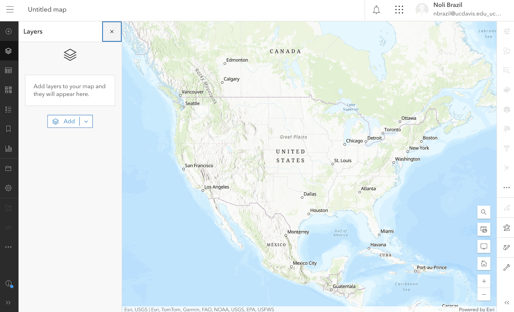
</center>
\
\vspace{0.5 in}

2. Click on 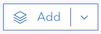 located on the left.  The two shapefiles you uploaded should show up under "My content".  Click on the file you named for la_tract_groc_dist ("Los Angeles Tract Grocery Distance (INSERT YOUR NAME HERE)"). Click on 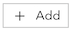 to add the layer to the map. Los Angeles tracts should pop up in your map and the panel Properties should have popped up to the right.

3. On the Properties panel, click on "Edit layer style". This will bring up a panel that will allow you to alter features of your map.

4. Now, we want to shade each of the tracts by their distance to the nearest grocery store. Basically, we are creating a choropleth map. Click on 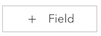 under Choose attributes. Select the variable *grocdist* from the pop down menu. This is the variable containing distance of the tract's centroid to the nearest grocery store.  We're going to shade the tracts based on this variable. Click on Add.

5. The "Pick a style" panel opens up, which provides options for how you want to shade your tracts.  Because *grocdist* is a numeric variable, the default option is "Counts and Amounts (color)", but you can create other map types based on the spatial data type (polygon, point, line) and variable type (numeric and categorical). 

6. The pull down menu below "Theme" allows you to select the color scheme. Keep it "High to low".  You can click "Style options" to change the color scheme and alter other visual features. For now, just leave the default settings.

7. Click on "Done" at the bottom.  You should get a map that looks like below.

<center>
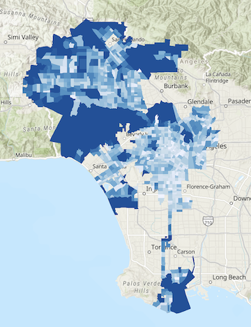
</center>
\
\vspace{0.5 in}

To bring up the Styles panel again, click on  on the right vertical panel. You'll notice other options in the right panel. These options will allow you to further adjust your map, including editing the pop-up window that shows up when you click on a tract and adding labels.

7. To save the map, click on 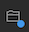 located on the left panel, and click on Save as. Provide an illustrative title ("Los Angeles Tract Distance to Nearest Grocery Store").  Add a tag ("Los Angeles"). Add a summary (optional). Leave the rest. Click on Save. You'll notice other options in the left panel. These are other options to adjust and edit your map, including adding a different basemap and adding a chart to your map. 

8. If you click on  at the top left and then Content, you should should see the map you just created listed at the top with the  label "Web Map".

9. Let's create another Web Map with the following two layers: la_tract_groc_dist and Los_Angeles_Metro_Stations.  Click on Map and then click on Open in Map Viewer.  Map la_tract_groc_dist again by going through steps 2-6.  

10. Add Los_Angeles_Metro_Stations on top of this map by going through steps 2-6 using Los_Angeles_Metro_Stations.  You should see Los Angeles metro stations as points pop up in your map. Under the "Pick a style" panel, you'll find ways to alter the color, shape and symbol of the points.  For example, you'll notice that for "Pick a style", you can create a heat map, which is a kernel density map. Don't choose any attributes to map, and leave "Location (single symbol)" selected.  Click on Done. You should get a map that layers Los Angeles Metro stations on top of Los Angeles city tracts shaded by distance to nearest grocery store (see below).   

<center>
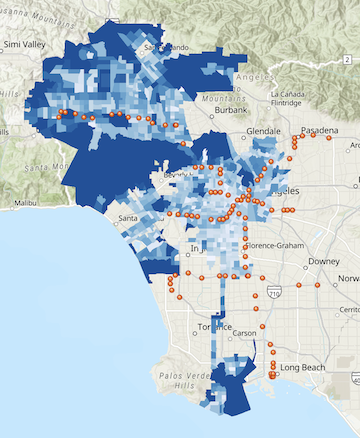
</center>
\
\vspace{0.5 in}

11. Follow step 7 to save this map (I named it "Los Angeles Tracts and Metro Stations")

Click on  at the top left and then Content. You should now see the two "Web Maps' you created at the top. To alter a Web Map, click on  to the right most of the Web Map, select Open in Map Viewer, and that will take you to the editing screen.

<div style="margin-bottom:25px;">
</div>
## **Create your StoryMap**
\

StoryMaps are web applications that combine interactive maps with multimedia content and text to tell your story.   They work on mobile phones, tablets, and PCs.  Think of them as web-based power point presentations that allow you to interact with maps.

Go to Esri's [StoryMap splash page](https://storymaps.arcgis.com/stories){target="_blank"}.   Click on Start a Story. Your [journey](https://www.youtube.com/watch?v=OMD8hBsA-RI){target="_blank"} has now begun.

1.  The first page is your title page.  You can construct the title page any way you deem fit. You can add an image or map to the background. It can be all text.  First, write in a title ("Spatial Access to Grocery Stores in Los Angeles").  You can also add a subtitle and a byline (e.g., your name and CRD 150).  Let's add an illustrative picture.  Click on "Add cover image or video" on the top right of the screen.  Browse to the folder you saved the Canvas files into.  Select the file los_angeles_photo.jpg and click on Add.  You should see a nice photo of the City of Angeles filling the background (can you guess where there is?).

2. You can alter how the intro page looks by clicking on Design at the top of the StoryMap. Under Cover, you can change how the cover photo is placed. For example, clicking on  will put the photo in the background. Play around with the other options to alter and enhance how your cover page looks.

3. If you scroll down, you'll notice a  and next to that the words "Tell your story".  Clicking on this is like adding a slide on your PowerPoint presentation.  Click on  and you'll see all the features you can add to your StoryMap.  We won't go through all of them due to time constraints, so I suggest playing around with the options on your own, but let's highlight the most popular features.  

<div style="margin-bottom:25px;">
</div>
### **Sidecar**
\

After clicking on , click on Sidecar, then select "Docked" (we'll cover "Slideshow" next, but you can test what "Floating" looks like on your own) and finally Save. A window may pop up telling you what a sidecar is. A sidecar has a large media panel on one side and a narrative panel on the other. As readers scroll through the narrative for each slide in the sidecar, the media changes to match the narrative. Here is an [ArcGIS tutorial](https://learn.arcgis.com/en/projects/build-a-sidecar-in-your-story/){target="_blank"} on sidecars. And here are two [best](https://storymaps.arcgis.com/stories/82509aafc8ba435f8c1264122d299763){target="_blank"} [practices](https://www.esri.com/arcgis-blog/products/arcgis-storymaps/mapping/6-ways-to-use-sidecar-in-the-new-arcgis-storymaps/){target="_blank"} guides for using sidecars in StoryMaps. Sidecars generally look something like this

<center>
 
</center>
\
\vspace{0.5 in}

1. Sidecars are great for showing photos. Add an image by clicking on "+ Add" and then "Image or video".  Click on "Browse your files" and add the photo vons.jpg (Southern Californians know what [Vons](https://www.vons.com/){target="_blank"} is all about!). The photo should fill up the right hand side of the screen. Click on  to edit features of the placement of the photo.

2. On the left side panel, click on   and click on "Text". Then click on “Heading 1” from the pull down menu that appears. This will give you a heading or title for this particular slide (I just wrote “Supermarkets”).  Underneath the title, click on , and select "Text" and then select "Bulleted list” from the pull down menu. Here, you can add bulleted text describing the image on the right and other major points. You can also add a numbered list or just text. You might get something that looks like below. 

<center>
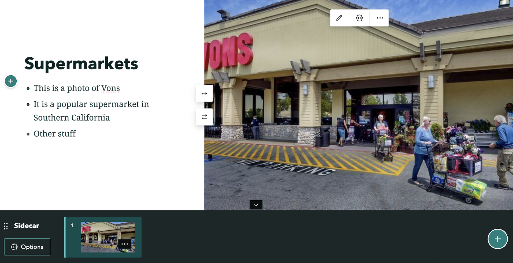 
</center>
\
\vspace{0.5 in}

3. Click on   on the bottom right corner of the screen.  This will add another slide to your sidecar.  This time add the photo stater_bros.jpg (another Southern California based [supermarket chain](https://www.staterbros.com/){target="_blank"}) and add some text on the left panel like you did in the Vons slide.

4. You can also add interactive maps to your sidecar.  Click   on the bottom right corner.  Click on "+ Add" and then  "Map". You should see the two maps you created earlier in your ArcGIS online account. Click on "Los Angeles Tract Distance to Nearest Grocery Store".  You should see a screen that looks like below.

<center>
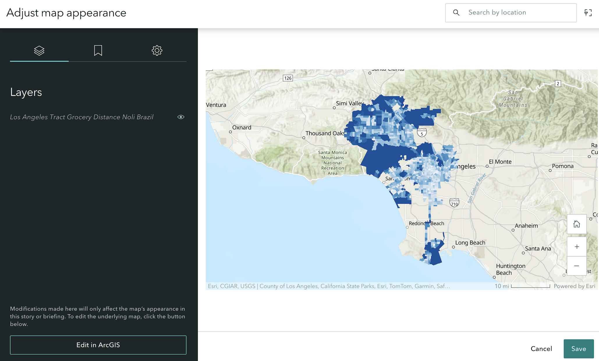 
</center>
\
\vspace{0.5 in}

5. You can format how the map will look like on your slide.  You can zoom into Los Angeles by clicking on   on the bottom right. You can rename the layer.  You can add a legend by clicking on  and sliding the button next to Legend to the right. This  should pop up on the bottom left corner of the screen indicating a legend is added. The user can click on it to open up the legend. If you want to always keep it open for the user, slide the button next to Keep legend open. You can also go back to ArcGIS Online to edit this map by clicking on "Edit in ArcGIS".  Play around with the other options to alter and enhance how your map will look like. Once you are done editing, click on "Save" located at the bottom right of the screen.

6. On the left panel, add a heading and text describing the map.

7. Let's add another slide with a map. Click on  and then click on "Add" and then "Map". Follow steps 4-6 above, but instead add the map "Los Angeles Tracts and Metro Stations" and add a header and some descriptive text.  You'll notice at the bottom of your sidecar all the slides you've added.  You can toggle back to the others if you want to edit them.

8.  Let's see what our sidecar looks like in action. Scroll back to the first slide.  Then scroll down using the bar on the right of your browser.  You'll notice the text scrolling down with the image on the right staying in place. When you reach the next slide, the new image and text will pop up. You'll also see the first map pop up and then the second map with the stations pop up.  Note that although ArcGIS Online allows some interactive map formatting and editing, it does not always yield visually captivating maps.  If you feel a static map that you've created in R is better, upload that onto your StoryMap.  The benefit of an interactive map is that it allows you while presenting and users while viewing your StoryMap to explore the map.

Explore the use of a [Floating Panel sidecar](https://www.esri.com/arcgis-blog/products/arcgis-storymaps/mapping/employing-and-enjoying-sidecars-docked-and-floating-panel-layouts/){target="_blank"} on your own. Floating panels are placed to minimize interference with the images as readers scroll.  Text within the sidecar sections is short (for longer text it’s usually advisable to use the docked panel layout). 

To delete a sidecar, click on Options located on the bottom left of the screen and select Delete sidecar.

<div style="margin-bottom:25px;">
</div>
### **Text and photos**
\

A sidecar is a particular StoryMap tool that allows the user to present their maps/images/text in an organized, visually appealing fashion.  Alternatively, you can just simply add plain text and photos without them being in a feature.  

1. Scroll out of the sidecar (just scroll down until you are below it). Click on  next to "Continue your story..." and select .  This will add a visual separator from the sidecar to signify the next stage of your StoryMap.

2. Beneath the separator, click on  and select . Add the image phisp_histogram.jpg. This is a histogram of percent Hispanic for census tracts in Los Angeles I created in R.  Click Add. You can add a caption to the photo, such as the source of the data (e.g., American Community Survey).

3. Beneath the image, click on  and select .  Then click "Heading 1" from the pull down menu that pops up. Type in the title "Percent Hispanic".  

4. Beneath the title, click on  and select .   Keep "Paragraph" selected from the pull down menu. Add the text "This is a histogram of percent Hispanic".

5. Hover your mouse over the histogram. Click on .  You should see that the image shifted to the left and the text is now to the right of the image.

<center>
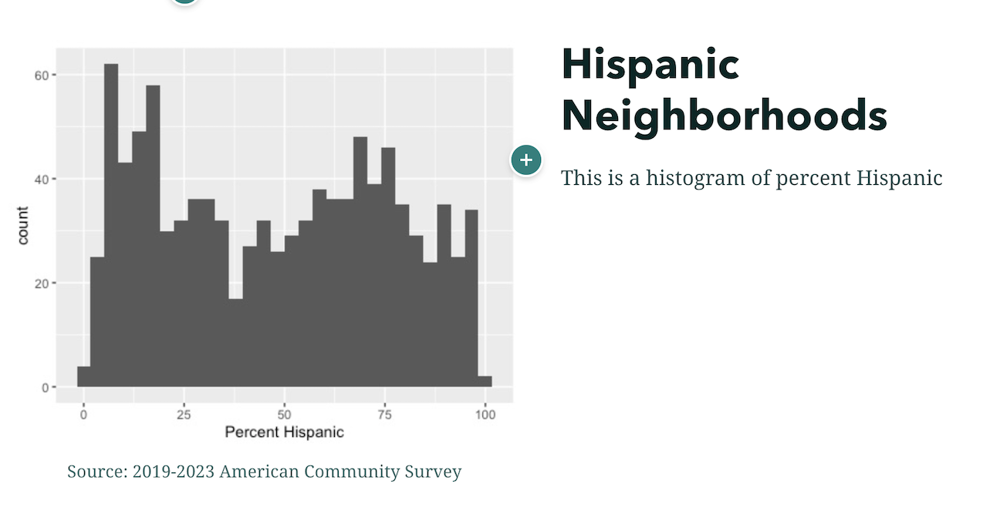 
</center>
\
\vspace{0.5 in}

6.  Click on  beneath your text "This is a histogram of percent Hispanic".  Follow steps 2-5 and add the photo pblk_histogram.jpg and text.  You should get something that will look like

<center>
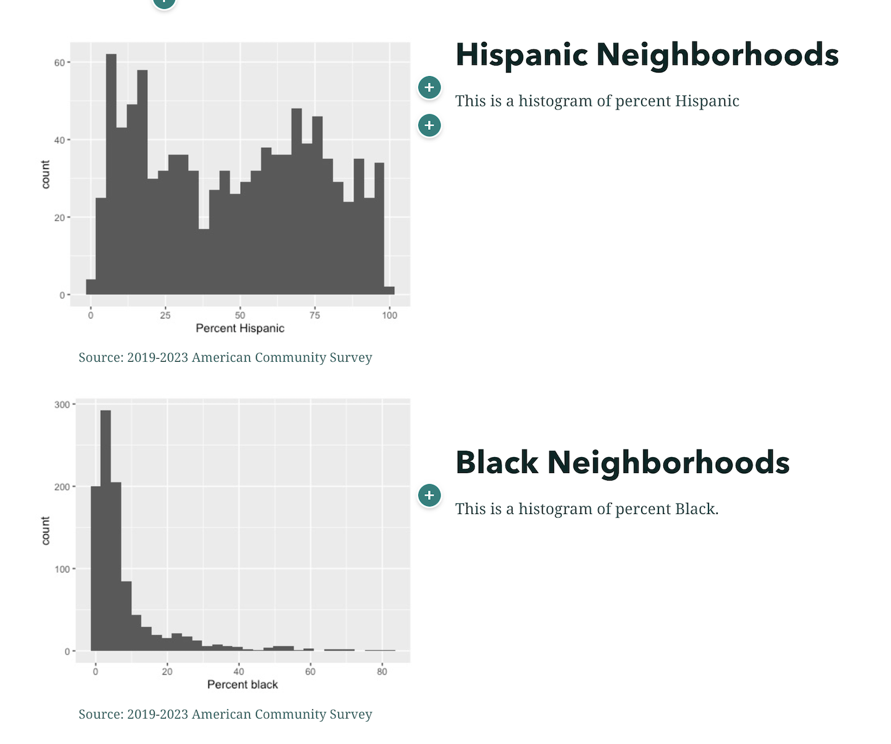 
</center>

<div style="margin-bottom:25px;">
</div>
### **Slideshow**
\


Another neat built-in StoryMap feature is the slideshow.  A slideshow offers a full-screen media and a floating narrative panel. The navigation for a slideshow is  horizontal.  A few ArcGIS guides on slideshows can be found [here](https://www.esri.com/arcgis-blog/products/arcgis-storymaps/constituent-engagement/slideshow-beta-a-new-immersive-block-in-arcgis-storymaps/){target="_blank"} and [here](https://teaching-research-storymaps-gisanddata.hub.arcgis.com/pages/building-a-slideshow){target="_blank"}. The flow of a sideshow will look something like

<center>
 
</center>
\
\vspace{0.5 in}

Let's add a slideshow.

1. Underneath the text for your percent black panel "This is a histogram of percent black", click on  and select  to add a separator.

2. Underneath the separator,  click on  and select Sidecar.  Then select Slideshow and Save.

3. In a slideshow, you can have an image, video or map in the background and floating text in the forefront.  Click on "+ Add" and select "Image or video". Click "Browse your files" and select the photo lametro.jpg. Click Add.

3. A photo of the beautiful Los Angeles transit system should fill the background of your slide.  Add some text (a heading and an explanation) directly into the white box located in the middle of the slide.

4. Click on  at the bottom right corner to add another slide.  Click on "+ Add" and then click on "Map".  Select the map "Los Angeles Tracts and Metro Stations".  You will find yourself in the same editing screen as the one earlier for the Sidecar.  Click on "Save" on the bottom right of the screen once you're done editing.  Los Angeles tracts and Metro stations should fill the background of your slide. This map is interactive - you  can zoom in and out and scroll around. Add  some text to the white box and you should get something like below.

<center>
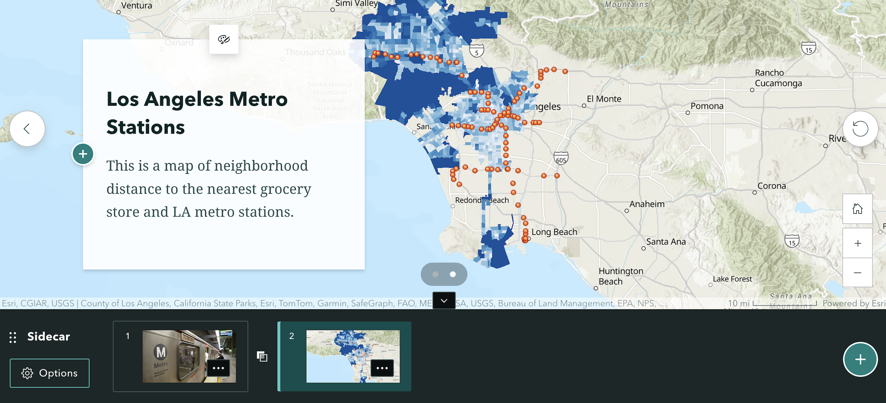 
</center>
\
\vspace{0.5 in}

 
6. When you are presenting your slideshow, click on the arrows  on the right and left of the screen to move from slide to slide. To delete the slideshow, select Options and Delete sidecar.

<div style="margin-bottom:25px;">
</div>
### **Navigation bar**
\

What if you want to give the viewers the ability to jump from one section to another? You do this by adding a navigation bar to your StoryMap.  Story navigation is an optional story element that provides readers with links to the main sections of your story. Story navigation can be configured as a table of contents or bookmarks that allow readers to go directly to different parts of a story. It also gives readers a visual indication of their current location in the story.

To add a navigation bar

1. Click on Design at the top of your StoryMap
2. Under Optional story sections, turn on Navigation. The story navigation bar appears at the top of the story below your intro page. Click on the X at the top right to exit the Design panel.
3. Hover over the Navigation bar, and click on . The Story navigation properties panel appears.
4. The navigation titles are based on any "Heading 1" you included in your StoryMap. You don't need to include all the Headers in your bar.  To take them out, deselect them from the panel. For example, we probably don't need navigation to both Hispanic Neighborhoods and Black Neighborhoods since we intended them to be on the same page.  So, we can deselect Black Neighborhoods. 
5. You can also change the navigation title in the panel.  This won't change the heading title in the StoryMap, just the title from the navigation bar. For example,  Hispanic Neighborhoods isn't a great navigation title.  Change it to something appropriate.  When you make the change, you will notice that Hispanic Neighborhoods remains the Heading in the StoryMap.
6. To include additional navigation bookmarks, you will need to include them as "Heading 1" in your StoryMap.  Story navigation can link to headings from the main body of the story, sidecar blocks, and the credits section. You can include up to 30 heading links in story navigation. Each heading link has a 30-character limit. To convert text into a heading, highlight the text you want to edit and select Heading from the text editing toolbar


<div style="margin-bottom:25px;">
</div>
## **Preview your StoryMap**
\

You can continue adding more features to your StoryMap as you see fit. One feature we will not cover are Map Tours. A Map Tour is a guided tour that lets you lead your audience through a curated set of places, one tour stop at a time. This is great if you are, for example, highlighting different areas of a community. The study described in [Davis et al., (2024)](https://journals.sagepub.com/doi/full/10.1177/10780874231177628){target="_blank"} used Map Tours to represent Black residents' perspectives living in a gentrifying neighborhood. See Esri's Map tour [tutorial](https://doc.arcgis.com/en/arcgis-storymaps/author-and-share/add-guided-tours.htm){target="_blank"} and curated examples of [Map tours](https://storymaps.arcgis.com/collections/dd4c2e6d5c2a40dd98e881f6ba616605?item=1){target="_blank"}.

Note that ArcGIS Online automatically saves your StoryMap as you are creating it. If you back to your ArcGIS Online Content page, you should see your StoryMap.  For example, I have

<center>
 
</center>

To Preview what your StoryMap will look like once you share it to the rest of the world, click on "Preview"" at the top of your StoryMap.  If you get a pop-up stating "Preview will reset undo history" click on "Yes, continue". Scroll through the presentation using the bar on the right and note any changes you want to make. Remember, a slideshow scrolls left to right whereas a sidecar strolls top to bottom.  Once you are done previewing, click on the X from  and you'll get sent back to the editing screen.  


<div style="margin-bottom:25px;">
</div>
## **Publish your StoryMap**
\

Once you are completely happy with your StoryMap, share it! 

1. Click on Publish at the top.  Under share, you will have two sharing options. The first is to share your StoryMap to "Everyone". This will provide access to your StoryMap to the public. The second is to share to "Organization" which is just to UC Davis staff, students, faculty and affiliates.  For this lab, click on Organization. Then click "Publish". You can share with everyone if you would like friends, family members, future employers, and others who don't have a UC Davis affiliation to see your StoryMap. Don't click on "Allow duplication" as this will allow others to copy your StoryMap. Click on the Publish button located on the top right of the screen.

2. The next page will likely ask you if would like to share the maps of Los Angeles you created.  You'll need to share them so that people can view your StoryMap, so click on "Update sharing".

3. You should get a message that states that your StoryMap is published. The website link is the link to your StoryMap (click on the "Copy link" button).  **This is the link that you will submit on Canvas for your final project**.   You can also take a  screenshot of the scan code to access the StoryMap on a phone.  As long as the individual is in your organization (i.e. UC Davis affiliate), they can access the map using the link or code.  To view your peers StoryMaps, you have to be logged onto your ArcGIS Online account.  

5. To edit your published StoryMap, click on  located at the top right of the screen and click Edit story. This will take you back to the editing screen.

6. To unpublish your StoryMap, click on  from the published StoryMap and click Edit story. From the editing screen, click on  and select "Unpublish story" to unshare it. If you are sure you want to unpublish, click on "Yes, unpublish" in the next screen. You can also change the settings such that you are sharing to Everyone. If you share your StoryMap to the everyone, you'll find this  at the top of your StoryMap.  You can share your StoryMap on social media. You can also copy the link to your StoryMap, which you can share to anyone, even if they don't have an ArcGIS Online account.

If you are looking for other resources to learn more about StoryMaps, check out Esri's [step-by-step guide](https://storymaps.arcgis.com/stories/cea22a609a1d4cccb8d54c650b595bc4){target="_blank"}.  There are also a number of examples and best practices found on Esri's [official StoryMaps splash page.](https://www.esri.com/en-us/arcgis/products/arcgis-storymaps/overview){target="_blank"}


<div style="margin-bottom:25px;">
</div>
## **Other StoryMap Resources**
\

We've only just touched on StoryMap's tools, functions, and possibilities.  Check out the following resources for more help, ideas and inspiration.

* [Planning and outlining your story map: How to set yourself up for success](https://www.esri.com/arcgis-blog/products/arcgis-storymaps/sharing-collaboration/planning-and-outlining-your-story-map-how-to-set-yourself-up-for-success/){target="_blank"}

* [Nine steps to great storytelling](https://storymaps.arcgis.com/stories/429bc4eed5f145109e603c9711a33407){target="_blank"}

* [The Myriad Uses of StoryMaps](https://storymaps.arcgis.com/stories/1b38cf02f39849478d3123dcd9465022){target="_blank"}

* [Skill for Good: Matching Storytellers with Cause-Driven Nonprofits](https://www.esri.com/arcgis-blog/products/story-maps/sharing-collaboration/skill-for-good-matching-storytellers-with-cause-driven-nonprofits/){target="_blank"}

* [Los Angeles City](https://controller.lacity.gov/data){target="_blank"} has some really cool examples of StoryMaps.

* So does [Dr. Willow Lung-Amam](http://www.willowlungamam.com/story-mapping
){target="_blank"}

* Child care in [Ohio](https://storymaps.arcgis.com/stories/8f7284470c6d4add93265ff30795b482){target="_blank"} 

* Esri's favorite StoryMaps in [2020](https://www.esri.com/arcgis-blog/products/arcgis-storymaps/mapping/our-favorite-stories-of-2020/){target="_blank"}

* Esri's favorite StoryMaps in [2021](https://www.esri.com/arcgis-blog/products/story-maps/constituent-engagement/2021-in-arcgis-storymaps-wrapped/){target="_blank"}

* Esri's favorite StoryMaps in [2022](https://www.esri.com/arcgis-blog/products/arcgis-storymaps/constituent-engagement/our-favorite-stories-of-2022/){target="_blank"}

* Esri's favorite StoryMaps in [2023](https://storymaps.arcgis.com/collections/68ba1955f063424884fc7c77dea8480e){target="_blank"}

* Esri's favorite StoryMaps in [2024](https://storymaps.arcgis.com/collections/474481db1f174de0b4f4f4cea8d2b6fb){target="_blank"}

* University of Minnesota has some helpful guides on harnessing the full features of StoryMaps [here](https://storymaps-umn.opendata.arcgis.com/pages/student-resources){target="_blank"}

And this ends your final lab of the quarter. Hip Hip [Hooray](https://www.youtube.com/watch?v=Rz1Xn1vzOM4){target="_blank"}!!


***

<a rel="license" href="http://creativecommons.org/licenses/by-nc/4.0/"></a><br />This work is licensed under a <a rel="license" href="http://creativecommons.org/licenses/by-nc/4.0/">Creative Commons Attribution-NonCommercial 4.0 International License</a>.


Website created and maintained by [Noli Brazil](https://nbrazil.faculty.ucdavis.edu/) and adapted by [Elise Zufall](https://environmentalpolicy.ucdavis.edu/people/elise-zufall)
