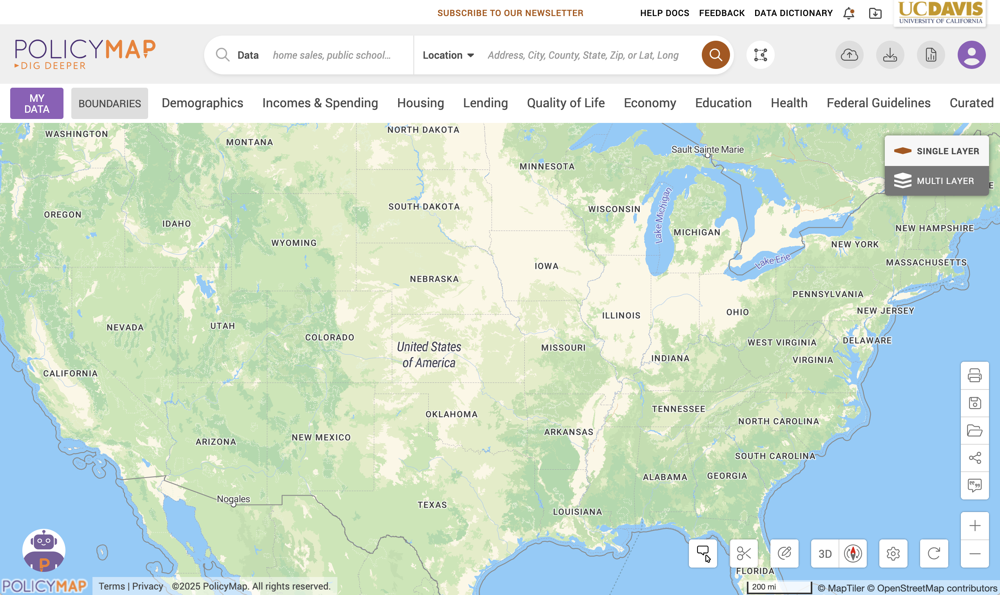
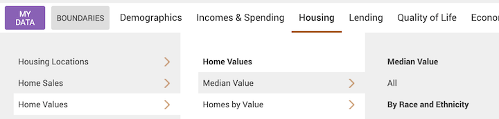
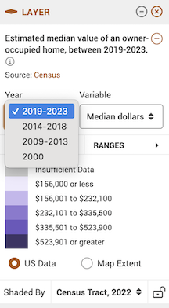
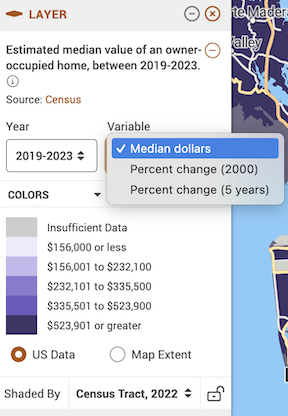
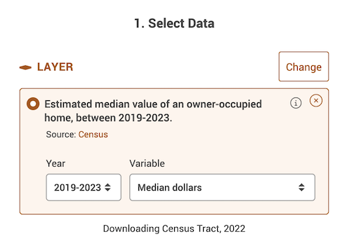
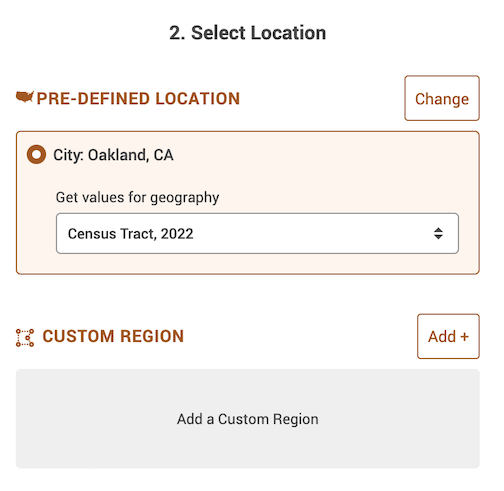
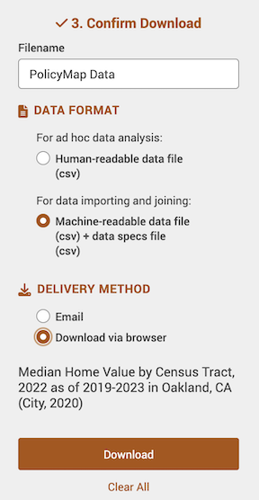
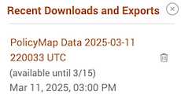
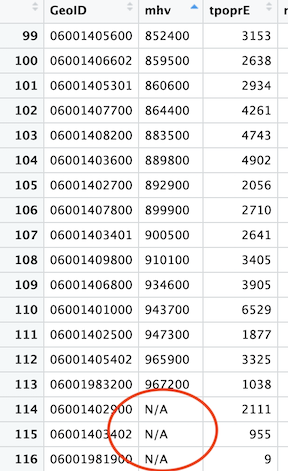

<style>
p.comment {
background-color: #DBDBDB;
padding: 10px;
border: 1px solid black;
margin-left: 25px;
border-radius: 5px;
font-style: normal;
}

.figure {
   margin-top: 20px;
   margin-bottom: 20px;
}

h1.title {
  font-weight: bold;
  font-family: Arial;  
}

h2.title {
  font-family: Arial;  
}

</style>


<style type="text/css">
#TOC {
  font-size: 13px;
  font-family: Arial;
}
</style>


\

```{r setup, include=FALSE}
knitr::opts_chunk$set(echo = TRUE, warning=FALSE, message = FALSE)
```


This guide provides step-by-step instructions for downloading data from [PolicyMap](https://ucdavis.policymap.com/newmaps#/). PolicyMap is a fully web-based online data and mapping application that gives you access to over 15,000 indicators related to demographics, housing, crime, mortgages, health, jobs and more. Data are available at all common geographies (address, block group, census tract, zip code, county, city, state, Metropolitan area) as well as unique geographies like school districts and political boundaries. 

In this guide, we will download PolicyMap census tract data for the City of Oakland. We will download median housing value.   UC Davis provides full access to all PolicyMap tools for staff, students, and faculty. We will download data from the UCD PolicyMap portal and clean up the files in R.   Much of this we already covered in [Lab 3](https://ezufall.github.io/crd150_2026.github.io/lab3.html).  

<div style="margin-bottom:25px;">
</div>
## **Installing and Loading Packages**
\

We'll be using the package **VIM** in this guide. Install it if you already haven't.

```{r warning = FALSE, eval=FALSE}
install.packages("VIM")
```

Then load it and the other packages we will be using in this guide.

```{r}
library(tidyverse)
library(tidycensus)
library(VIM)
```


<div style="margin-bottom:25px;">
</div>
##  **Download data**
\


1. Navigate to the UC Davis [PolicyMap portal](https://ucdavis.policymap.com/maps).  You should see a webpage that looks like the figure below.  Note the UC Davis logo on the top right.  Go Aggies!

<center>


</center>


2. You should see a *Location* search bar somewhere near the top of the page.  Type in "Oakland, CA" in the search bar and *Oakland, CA (City)* should pop up below - select it.

<center>


</center>

You should get a map that highlights Oakland's boundaries.

<center>


</center>

3. The map does not show any data.  Let's add Median Housing Value. Click on the *Housing* tab, followed by *Median Value* under *Home Values*.

<center>


</center>

Now your map should look like the following

<center>


</center>

4. Notice in the legend window you can change various aspects of the variable, including the year

<center>


</center>

the data type

<center>


</center>

and the geographic level.  

<center>


</center>

**Be very careful about the geographic level. Users often do not realize that they are downloading an incorrect geographic scale. For example, you want to download census tract, but instead you download the Zip code. If you find that the geographic scale is greyed out under the pull down menu, Zoom in and out of the map.**


Leave the defaults (Year: 2019-2023, Variable: Median dollars, and Shaded by: Census Tract, 2022).  

5. Let's download these data.  At the top right of the site, click on the download icon .  


6. A window should pop up. The first screen on the left (Select Data) tells you what data to download - it should be "Estimated median value of owner-occupied home, between 2019-2023" under Layer, with "2019-2023" under Year and "Median dollars" under Variable already selected.

<center>


</center>


7. The next section (Select Location) asks you to select a location.  It should be *City: Oakland, CA* and *Census Tract, 2022* for "Get values for geography".    


<center>


</center>


8. The last section asks you to confirm the download. Select *Machine-readable data file (csv) + data specs file (csv)* under "Data Format". Select *Download via browser* under "Delivery Method". Then click on the Download button.

<center>


</center>

9. After a minute or two, a screen like below (on a Mac laptop) should pop up at the top right corner of your screen (the file name will differ from yours).  You can download this file again until the date given.

<center>


</center>


10. PolicyMap allows you to download only one variable at the time.  So, you'll need to go through the above steps again to get other variables. 


**After you've downloaded a csv file whether through PolicyMap or another source, do not open it up in Excel to manipulate or alter the data in any way. All of your data wrangling should be done in R**

<div style="margin-bottom:25px;">
</div>
## **Data Wrangling in R**
\

Bring in the data using `read_csv()`. 

```{r eval = FALSE}
pm.file <- read_csv("YOUR FILE NAME HERE")
```

```{r echo = FALSE}
pm.file <- read_csv("PolicyMap Data 2025-12-19 003743 UTC.csv")
```

Make sure to take a look at the data.

```{r}
glimpse(pm.file)
```

Let's keep the necessary variables: *GeoID* and *mhv*. *GeoID* is the tract GEOID.

```{r}
pm.file <- pm.file %>%
          select(GeoID, mhv)
```


<div style="margin-bottom:25px;">
</div>
### **Merging with Census API data**
\

Let's bring in some census data from the Census API.  We covered how to use `get_acs()` from the **tidycensus** package in [Lab 3](https://ezufall.github.io/crd150_2026.github.io/lab3.html). Make sure the ACS years match up between PolicyMap and Census API data. Census tract boundaries changed in 2020, which means that 2016-2020 tract data will not completely merge with ACS data between 2010 and 2019.

```{r message = FALSE, warning = FALSE}
ca <- get_acs(geography = "tract", 
              year = 2023,
              variables = c(tpopr = "B03002_001", 
                            nhwhite = "B03002_003", nhblk = "B03002_004", 
                            nhasn = "B03002_006", hisp = "B03002_012"), 
              state = "CA",
              survey = "acs5",
              output = "wide")

ca <- ca %>%
        select(GEOID, tpoprE, nhwhiteE, nhblkE, nhasnE, hispE)
```

Merge in *ca* into *pm.file*.  The linking variable is *GeoID* in *pm.file* and *GEOID* in *ca*.

```{r}
pm.file <- pm.file %>%
              left_join(ca, by = c("GeoID" = "GEOID"))
```

Take a look at the data to make sure the merge went well.

```{r}
glimpse(pm.file)
```

<div style="margin-bottom:25px;">
</div>
### **Dealing with missing values**
\

Missing values are a part of a social scientist's life.  You can't avoid them.  

You will notice that PolicyMap designates missing values as *N/A*.  

<center>


</center>


R designates missing as *NA*.  Therefore, R reads *N/A* as a character. This means that R does not recognize *mhv* as a numeric but a character.

```{r}
class(pm.file$mhv)
```

We need to replace *N/A* with *NA* and then convert it to numeric

```{r}
pm.file <- pm.file %>%
              mutate(mhv = as.numeric(ifelse(mhv == "N/A", "NA", mhv)))
```

The code `ifelse(medval == "N/A", "NA", medval)` says that if the variable *mhv* equals "N/A", replace it to "NA", else keep its original value stored in *mhv*.  `as.numeric()` converts *mhv* to a numeric.

```{r}
class(pm.file$mhv)
```

The next step is to determine what percentage of your cases are missing data.  The best function for doing this in R is `aggr()`, which is in the **VIM** package. Run the `aggr()` function as follows

```{r warning=FALSE, message=FALSE}
summary(aggr(pm.file))
```

The results show two tables and two plots.  The left-hand side plot shows the proportion of cases that are missing values for each variable in the data set.  The right-hand side plot shows which combinations of variables are missing.  The first table shows the number of cases that are missing values for each variable in the data set. The second table shows the percent of cases missing values based on combinations of variables.  The results show that 3 or 2.6% of census tracts are missing values on the variable *mhv*. 

In any statistical analysis, you will need to deal with missing values. For example, if you wanted to find out the average median housing value in Oakland tracts, you would type in

```{r}
mean(pm.file$mhv)
```

The mean is *NA*, which tells you that there are missing values in the variable *mhv* that you need to deal with before R calculates a value. There are many ways that one can deal with missing data. One method is to just simply ignore or discard cases with a missing value.  To do this in the `mean()` function (and in many other R functions), you include the argument `na.rm = TRUE`

```{r}
mean(pm.file$mhv, na.rm = TRUE)
```

As long as a large proportion of your data set is not missing data, simply ignoring missing data is often acceptable.  Just make sure you are transparent about what you did. 

***

<a rel="license" href="http://creativecommons.org/licenses/by-nc/4.0/"></a><br />This work is licensed under a <a rel="license" href="http://creativecommons.org/licenses/by-nc/4.0/">Creative Commons Attribution-NonCommercial 4.0 International License</a>.


Website created and maintained by [Noli Brazil](https://nbrazil.faculty.ucdavis.edu/) and adapted by [Elise Zufall](https://environmentalpolicy.ucdavis.edu/people/elise-zufall)